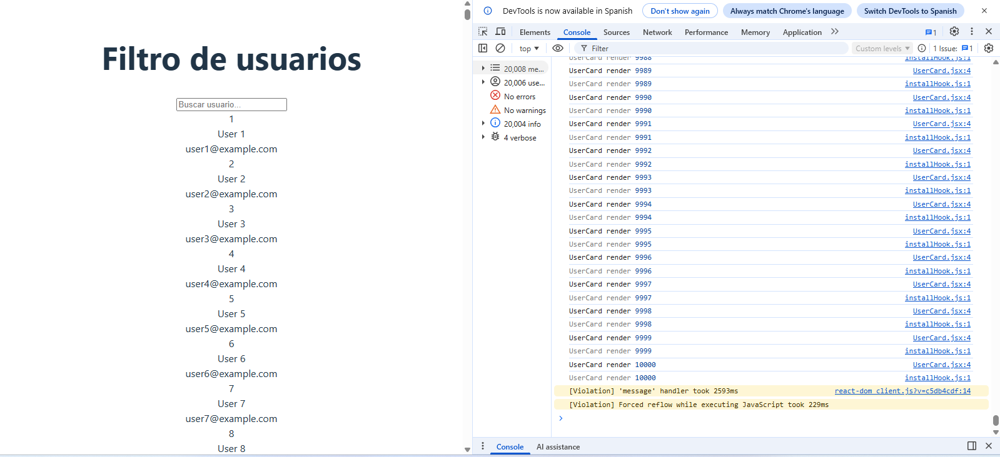
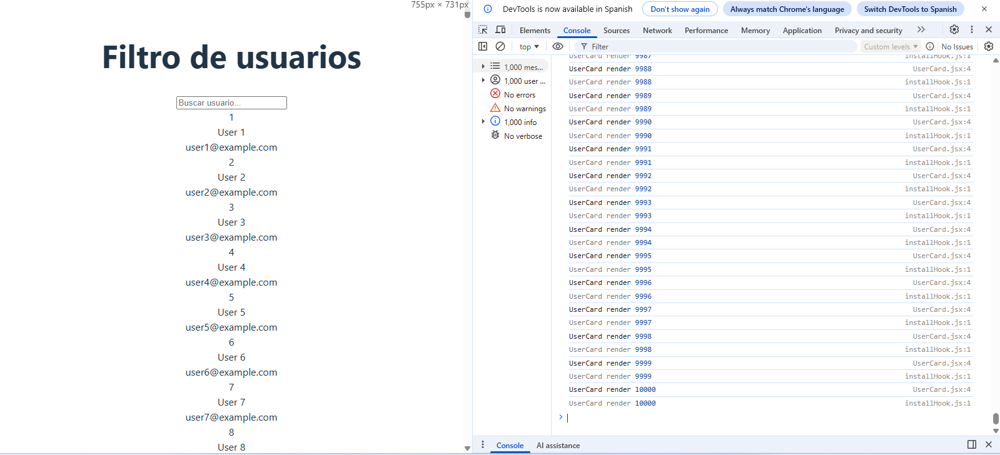

# Ejercicio 2 – Filtro de usuarios caro/barato

## 1. Versión sin optimizar
- Lista de 10.000 usuarios generada en cada render.
  - App se vuelve muy lenta.
- Captura de Profiler antes:

## 2. Versión optimizada
- Cambios realizados:
  - Memoización de lista de usuarios: `useMemo`.
  - Memoización del filtrado: `useMemo`.
  - Memoización de componentes: `React.memo` en `UserCard`, `UserList` y `SearchInput`.
- Observaciones:
  - Solo se renderizan los `UserCard` filtrados.
  - App mucho más fluida.
  - Console.log reducido drásticamente.
  - Unicamente 1000 logs
- Captura de Profiler después:

## 3. Explicación
- Antes: cada render recalculaba la lista completa y re-renderizaba todos los componentes.
- Después: `useMemo` evita recalcular lista y filtrado innecesario; `React.memo` evita render de componentes que no cambian.
- Resultado: render mínimo necesario y mejor rendimiento.
